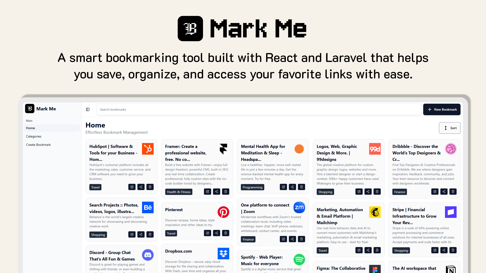

<p align="center">
  
</p>

## Mark Me

**Mark Me** is a smart bookmarking tool built with React and Laravel that helps you save, organize, and access your favorite links with ease.

### Features

-   **Categories and bookmarks**: Create and manage bookmarks with categories
-   **File uploads**: Upload images/icons for visual bookmarks
-   **Modern stack**: Laravel API + React UI, Vite, Tailwind CSS

## Installation

### Prerequisites

-   **PHP 8.2+**, **Composer**
-   **Node.js 18+** and **npm**
-   **SQLite** (or update `.env` for your database)

### 1) Clone and install dependencies

```bash
git clone <your-repo-url> mark-me
cd mark-me
composer install
npm install
```

### 2) Environment setup

```bash
cp .env.example .env
php artisan key:generate
```

Use SQLite (default in this repo) by creating the database file and setting the driver:

```env
DB_CONNECTION=sqlite
DB_DATABASE=./database/database.sqlite
```

Create the SQLite file:

-   Windows (PowerShell):

```powershell
New-Item -ItemType File database\database.sqlite -Force
```

-   macOS/Linux:

```bash
touch database/database.sqlite
```

### 3) Storage link and migrations

```bash
php artisan storage:link
php artisan migrate --seed
```

### 4) Run the app (dev)

Run backend and frontend in separate terminals:

```bash
php artisan serve
```

```bash
npm run dev
```

The app will be available at the URL from `php artisan serve`, with assets served by Vite (`npm run dev`).

### Production build (optional)

```bash
npm run build
```

Serve the built assets per your hosting setup. Ensure `APP_URL` and `VITE_*` settings in `.env` are correct.

## License

This project is open-sourced software licensed under the MIT license.
